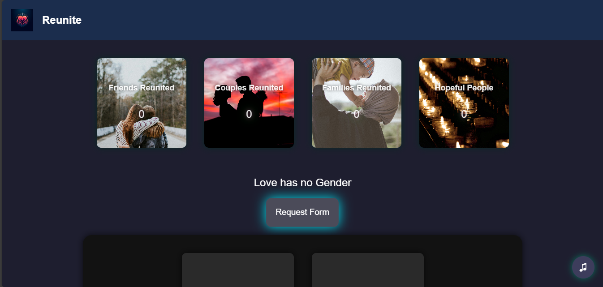
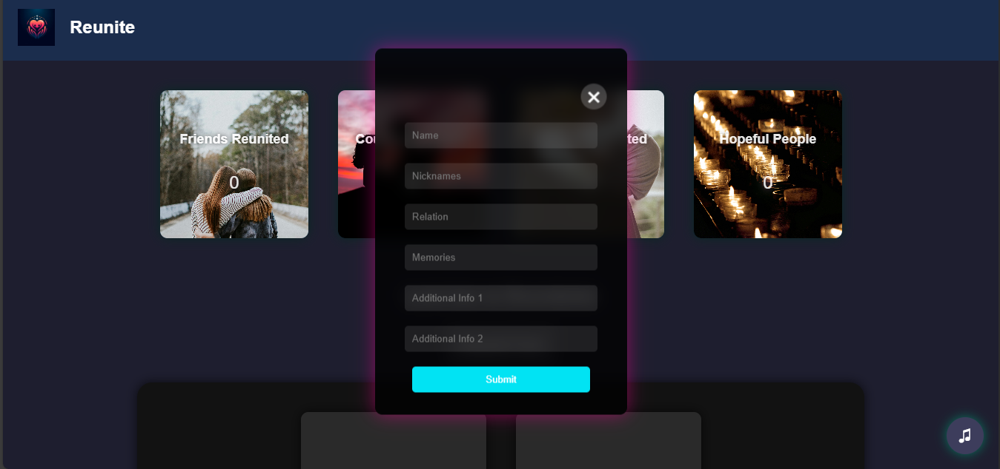
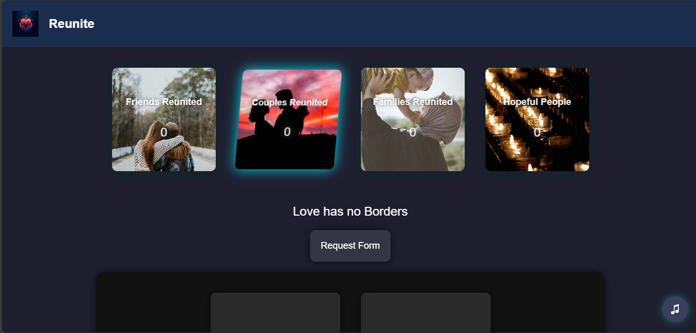

Here's how you can structure your updated **README.md** file with a section for test URLs and screenshots:

---

# **Reunite**  
This is a prototype for Project Reunite, which helps friends, couples, and families reconnect with their loved ones. This web project demonstrates a basic working model of how the system operates.

---

## **Features**  
- Submit and store relationship information.  
- View stored data as interactive tiles with a visually appealing interface.  
- Background music and rotating quotes to enhance user experience.  
- Dynamic forms for entering data.  

---

## **Test URL**  
You can access the test version of the Reunite project at:  
[**Test URL**]([http://your-test-url-here.com](https://satoshimacchihuda.pythonanywhere.com/))  


## **Screenshots**  
Below are some screenshots of the Reunite project in action:

### **1. Homepage**  
  

### **2. Form Submission**  
  

### **3. Interactive Tiles**  
  

### **3. Music Button**  
  

---

## **Setup and Installation**  

### Prerequisites  
- Python 3.x  
- Flask  

### Steps to Run Locally  
1. Clone the repository:  
   ```bash
   git clone https://github.com/your-repo/reunite.git
   cd reunite
   ```
2. Install dependencies:  
   ```bash
   pip install flask flask-cors
   ```
3. Run the Flask server:  
   ```bash
   python server.py
   ```
4. Open your browser and go to:  
   ```
   http://127.0.0.1:5000/
   ```

---

## **Contributing**  
Feel free to fork this repository, make your changes, and submit a pull request. Contributions are always welcome!

---

## **License**  
This project is licensed under the MIT License.

---

